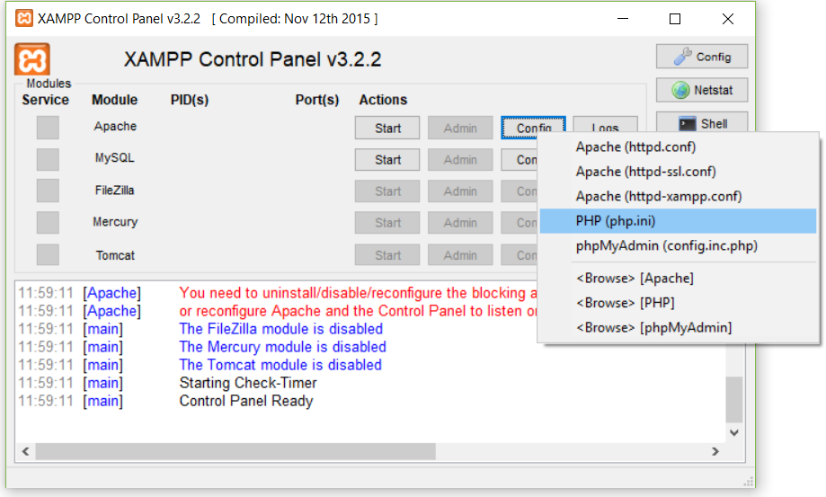
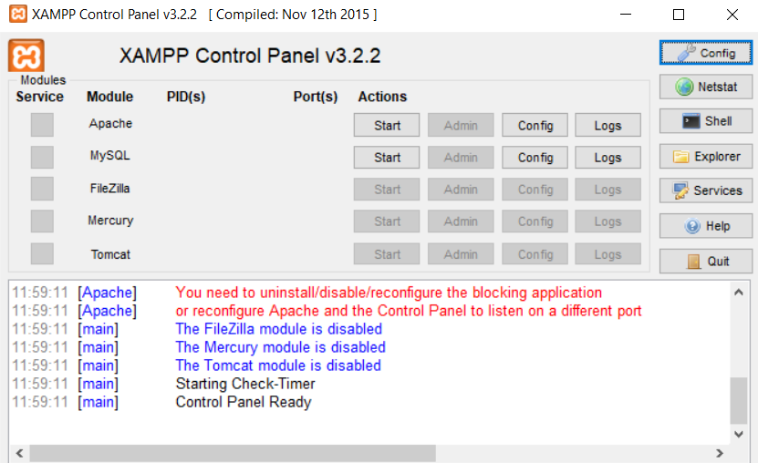

# Webpage Toaster

## Description:
Webpage Toaster is a tool to support page performance optimization using static testing and reporting. 

For convenience it is designed to run locally on a Windows machine using [XAMPP](https://www.apachefriends.org/download.html) but can be configured for any web server.

## Technologies:
- [XAMPP](https://www.apachefriends.org/download.html) ([Apache](https://httpd.apache.org/), [PHP](http://www.php.net/))
- [ImageMagick](https://www.imagemagick.org/script/download.php.)
- [Node.js](https://nodejs.org/en/download/) 

## Installation instructions:

Create a directory **“C:\toast"**, and subdirectory **“C:\toast\uploads”**. This will be where all of the web page data will be saved (plus any uploaded HAR files).


Copy the **"toaster"** folder to the webserver root. For [XAMPP](https://www.apachefriends.org/download.html ), this will be the **c:\xampp\htdocs** folder.


## Installation prerequisites:

Install [XAMPP](https://www.apachefriends.org/download.html ) for Windows.
- Run the [XAMPP](https://www.apachefriends.org/download.html ) installer (with admin privileges) to “c:\xampp”


From [XAMPP](https://www.apachefriends.org/download.html ) control panel, edit the Apache config. **“HTTP.conf”** file as below:


- Create a web server virtual directory by adding the following to the bottom of the .conf file:

``` apache 
       Alias /toast C:/toast
       <Directory "C:/toast">
              Options FollowSymLinks
              AllowOverride None
              Order deny,allow
              Require all granted
       </Directory>
```

- Enable the following modules by removing the leading _**#**_  (if present):
```apache
       LoadModule deflate_module modules/mod_deflate.so
       LoadModule expires_module modules/mod_expires.so
       LoadModule filter_module modules/mod_filter.so
       LoadModule http2_module modules/mod_http2.so
       LoadModule headers_module modules/mod_headers.so
```
- Add the following text to the bottom of the .conf file:
```apache
       AddOutputFilterByType DEFLATE text/html text/plain text/xml text/css text/javascript application/javascript
       DeflateCompressionLevel 9 

       Protocols h2 http/1.1
```

From the [XAMPP](https://www.apachefriends.org/download.html ) control panel, edit the _File Uploads and Resource Limits_ section of Apache's **“PHP.ini”** file:




```apache
       upload_tmp_dir = "C:\temp"
       upload_max_filesize = 10M
       max_execution_time = 900
       memory_limit=1G
```

- Enable the following modules by removing the leading **_;_** (if present):
```apache
       extension=curl
       extension=mbstring 
       extension=openssl
```
Download [ImageMagick](https://www.imagemagick.org/script/download.php.) and copy it to **"c:\ImageMagick"** folder.


In order to use Headless Chrome, install [Node.js](https://nodejs.org/en/download/) and add the application folder, **"C:\Program Files\nodejs\node_modules\npm\bin"**, to your Windows **Path** environmental  variable. This can be confirmed by using the **node -v** command from the Windows **Cmd** application. 


## Operation instructions:

Start Apache via the [XAMPP](https://www.apachefriends.org/download.html ) Control Panel.



Open [toaster](
http://localhost/toaster/toaster.htm) from your browser. To review a previous round of toast, use the [toasted](
http://localhost/toaster/toasted.php) history.


To toast a page, enter the page address in the URL field. Toaster defaults to HTTP, so  include the scheme for anything else. 

Click **“Toast it!”** to run the analysis. 

To review the results, click **“View History”**.

To toast multiple pages, enter a comma separated list of URLs and click “Toast it!”.

#### Options:

##### _Real(*WPT)/Emulated Device_
_Default: “Chrome Desktop”_
- Select the device to be used to load the page.
- When “WPT” is selected as the Web Browser Engine, the device will be a real device – these are denoted with an * in the dropdown. Choose one of these if you want to use WPT and run the test on a real device.

##### _Get All Available Objects_
_Default: unchecked_
- Leave this unchecked to only download objects referenced by the target page.
- Check this to download all objects referenced in a page’s CSS. This can be useful when:
    + a page is used in multiple languages; seeing all objects for all languages can help to highlight duplications
    + a site uses responsive images; seeing all variations of an image at different sizes can help analysis of the responsiveness of the site

##### _Show Page Links_
_Default: unchecked_
- Check this to display an additional tab listing additional pages to which the target page links.
- This can be used to generate a list of URLs that can be either used in PA, WebPageTest bulk or in Toaster’s conveyor testing.

##### _Use Eggplant 3rd Party DB_
_Default: checked_
- Domains will be checked against the Eggplant Third Party Database and the details of any identified domains will be shown within the results.
- Domains are identified via defined regex statements
- Third party details include: Company, Product, Group, Category and Description

##### _Show Debug Msgs_
_Default: unchecked_
- Used for debugging purposes – you won’t need to select this

##### _Get Akamai Debug Hdrs_
_Default: unchecked_
- If a site is served from Akamai, check this to request Akamai debug headers to be returned to aid any investigations

##### _Get 3rd Party Call Chain_
_Default: checked_
- The relationships from, to and between third parties are identified during third party analysis.
- Relationships are detected using various levels of URL matching in files. This approach is independent of any particular browser.
- This feature powers Toaster’s advanced request map and hierarchy features.
- As this analysis can take an extra minute, uncheck this when a page is known to have many third party objects and the request map is not required.

##### _Geo IP Location Lookup_
_Default: Domain_
- Other options: None, All
- Geo IP location can take time. Select “None” if you are not interested in locations and need to quickly toast a page
- “Domain” level is normally good enough for most purposes and means that the customer site will be checked, but third parties and CDNs will not
- Select “All” for the most detailed level of analysis.

##### _Geo IP API Provider_
_Default: Freegeoip_
- **Freegeoip** provides country-level locations but has no restrictions
- Other options: db-IP and HackerTarget
    + **db-IP** provides the most details, city-level locations and is limited to 2,500 per day across all Toaster users.
        + Use this option when you need the greatest level of location accuracy
    + **HackerTarget** provides country-level locations and has no restrictions. It is not as good as Freegeoip except that it is Australia-focussed. If you’re Toasting an Australian site, then select this provider in the first instance.

##### _Web Browser Engine_
- Several options are available – each has its own advantages and disadvantages:
- Choose “WPT” if you want to run a test on a real device using a local WPT instance
    + Note that Toaster will only use a single view of the page and will not report upon an object’s parent or differentiate between objects loaded via injection and those loaded otherwise.
    + Advantages
        + Uses real devices
        + Provides a “Render Start Time”
    + Disadvantages
        + Does not provide a Final view of the page DOM, and injections cannot be determined in order to compare source objects vs injected objects
- Choose “CH Headless”, if you have [Node.js](https://nodejs.org/en/download/)  installed and you want to test via Chrome Headless (real device)
    + Advantages
        + Uses the real Chrome browser
        + Provides a Final view of the page DOM, and injections cannot be determined in order to compare source objects vs injected objects
    + Disadvantages
        + Does not provide “Render Start Time”
	
- Choose a “WebKit” version to run PhantomJS for an emulated device
    + V1.9 is available but has been removed from the options
    + V2.0 and v2.1 are available for use
        + Advantages
            + Provides a Final view of the page DOM, and injections cannot be determined in order to compare source objects vs injected objects
            + V2.1 does not download WOFF2 fonts by default
- Choose “Gecko” to run Slimer JS using FireFox and for an emulated device
    + Advantages
        + Uses the real Firefox browser
        + Provides a Final view of the page DOM, and injections cannot be determined in order to compare source objects vs injected objects
    + Disadvantages
        + May not always work with later Firefox versions

##### _Auth Username and Password_
- Enter these when a site demands it

##### _Notes_
- Add any notes you wish to make to help identify the test in the history page.

##### _Upload HAR_
- HAR files can be uploaded independently and identified objects will be used by Toaster to supplement its own detection
- With the availability of using WPT as the browser engine, this option may not be needed.


## _Copyright (c) 2018 Eggplant_

    Licensed under the Apache License, Version 2.0 (the "License");
	you may not use this file except in compliance with the License.
	You may obtain a copy of the License at

    http://www.apache.org/licenses/LICENSE-2.0

	Unless required by applicable law or agreed to in writing, software
	distributed under the License is distributed on an "AS IS" BASIS,
	WITHOUT WARRANTIES OR CONDITIONS OF ANY KIND, either express or implied.
	See the License for the specific language governing permissions and
	limitations under the License.